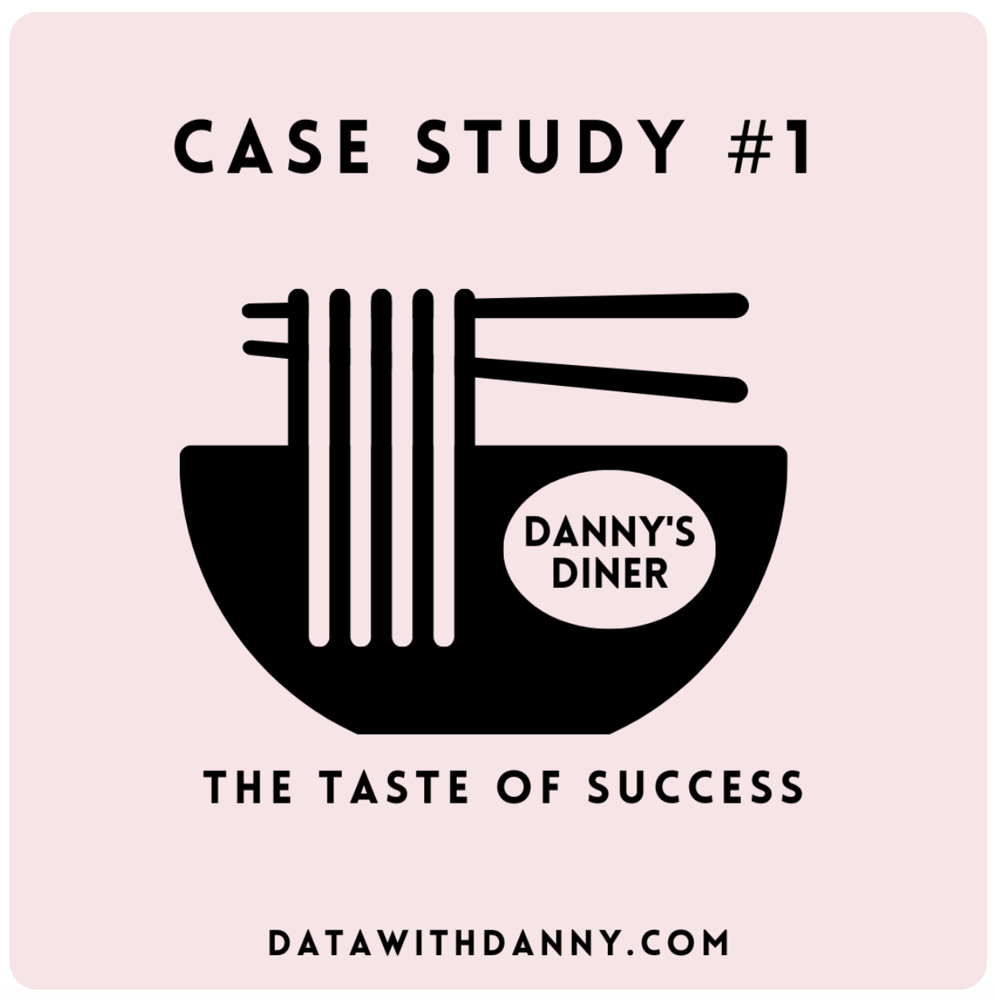

<div align="center">
  <h1>Danny’s Diner SQL Case Study</h1>
  <p>Exploring Customer Behavior and Menu Insights Using SQL</p>
  
</div>

# Case Study 1: Danny’s Diner

## Introduction
Welcome to the Danny’s Diner SQL case study! In this project, we'll dive into a series of SQL queries to analyze customer transactions and menu items at Danny’s Diner. Let's explore how SQL can help us answer various questions about customer behavior, popular menu items, and more.

## Entity Relationship Diagram


## Queries and Explanations

### 1. Total Amount Spent by Each Customer
```sql
SELECT
    SUM(menu.Price) AS Total_Sales_Amount,
    Sales.Customer_ID
FROM
    dannys_diner.Sales
JOIN
    dannys_diner.Menu ON Sales.Product_ID = Menu.Product_ID
GROUP BY
    Sales.Customer_ID;
```
This query calculates the total amount each customer spent at the restaurant by joining the Sales and Menu tables on the Product_ID. The ```SUM``` function aggregates the total sales amount for each customer.

| total_sales_amount | customer_id |
|-------------------|-------------|
| 74                | B           |
| 36                | C           |
| 76                | A           |


### 2. Number of Days Visited by Each Customer
```sql
SELECT
    Sales.Customer_ID AS Customer,
    COUNT(sales.Order_Date) AS Days_Visited
FROM
    dannys_diner.Sales
GROUP BY
    Sales.Customer_ID;
```

This query calculates the number of days each customer visited the restaurant by counting the unique ```Order_Date``` entries for each customer.

| customer | days_visited |
|----------|--------------|
| B        | 6            |
| C        | 3            |
| A        | 6            |

### 3. First Item Purchased by Each Customer
```sql
SELECT Customer, Product
FROM (
    SELECT
        Sales.Customer_ID AS Customer,
        Menu.Product_Name AS Product,
        RANK() OVER (PARTITION BY Sales.Customer_ID ORDER BY Sales.Order_Date) AS Rank
    FROM
        dannys_diner.Sales
    JOIN
        dannys_diner.Menu ON Sales.Product_ID = Menu.Product_ID
) ranked_sales
WHERE Rank = 1;
```
In summary, this query creates a ranked list of customer purchases based on order dates. It then selects the first purchased item for each customer and presents the results by customer and product name.

| customer_id | product_name |
|-------------|--------------|
| A           | curry        |
| A           | sushi        |
| B           | curry        |
| C           | ramen        |

### 4. Most Purchased Menu Item and Total Count
```sql
SELECT 
  menu.product_name,
  COUNT(sales.product_id) AS most_purchased
FROM dannys_diner.sales
INNER JOIN dannys_diner.menu
  ON sales.product_id = menu.product_id
GROUP BY menu.product_name
ORDER BY most_purchased DESC
LIMIT 1;
```

This query retrieves the most purchased menu item from the dannys_diner database:

| product_name | most_purchased |
|--------------|----------------|
| ramen        | 8              |

### 5. Most Popular Item for Each Customer
```sql
WITH product_counts AS (
    SELECT
        Customer_ID, Product_ID, COUNT(Product_ID) AS product_count
    FROM
        dannys_diner.Sales
    GROUP BY
        Customer_ID, Product_ID
)
SELECT Ranks.Customer_ID, Menu.Product_Name, Ranks.product_count, Ranks.rank
FROM (
    SELECT *,
        RANK() OVER (PARTITION BY Customer_ID ORDER BY product_count DESC) AS "rank"
    FROM product_counts
) Ranks
JOIN dannys_diner.Menu ON ranks.Product_ID = Menu.Product_ID
WHERE ranks.rank = 1
ORDER BY ranks.Customer_ID;
```

This query uses a common table expression (CTE) to count the number of times each menu item is purchased by each customer. It then ranks items based on their purchase count and selects the most popular item for each customer.

| customer_id | product_name | product_count | rank |
|-------------|--------------|---------------|------|
| A           | ramen        | 3             | 1    |
| B           | sushi        | 2             | 1    |
| B           | curry        | 2             | 1    |
| B           | ramen        | 2             | 1    |
| C           | ramen        | 3             | 1    |

### 6. First Item Purchased by Customer After Joining
```sql
WITH First_Boughts AS (
  SELECT sales.*, menu.product_name,
         RANK() OVER (PARTITION BY sales.customer_id ORDER BY order_date ASC) AS "Rank"
  FROM dannys_diner.sales
  JOIN dannys_diner.menu
  ON sales.product_id = menu.product_id
  Join dannys_diner.members
  on sales.customer_id = members.customer_id
  where sales.order_date > members.join_date 
)
SELECT customer_ID, Product_Name
FROM First_Boughts
where "Rank" = 1;

```

This query identifies the first item purchased by each customer after joining the membership program. It uses a CTE to filter purchases made after the customer's join date.

| customer_id | product_name |
|-------------|--------------|
| A           | ramen        |
| B           | sushi        |

### 7. Last Item Purchased by Customer Before Joining
```sql
WITH Last_Boughts AS (
  SELECT sales.*, menu.product_name,
         RANK() OVER (PARTITION BY sales.customer_id ORDER BY order_date DESC) AS "Rank"
  FROM dannys_diner.sales
  JOIN dannys_diner.menu
  ON sales.product_id = menu.product_id
  Join dannys_diner.members
  on sales.customer_id = members.customer_id
  where sales.order_date < members.join_date 
)
SELECT customer_ID, Product_Name, Order_Date
FROM Last_Boughts
where "Rank" = 1;
```

This query identifies the last item purchased by each customer before joining the membership program. It uses a CTE to filter purchases made before the customer's join date.

| customer_id | product_name | order_date                |
|-------------|--------------|---------------------------|
| A           | sushi        | 2021-01-01T00:00:00.000Z  |
| A           | curry        | 2021-01-01T00:00:00.000Z  |
| B           | sushi        | 2021-01-04T00:00:00.000Z  |


### 8. Total Items and Amount Spent for Each Member Before Joining
```sql
SELECT 
  sales.customer_id, 
  COUNT(sales.product_id) AS total_items, 
  SUM(menu.price) AS total_sales
FROM dannys_diner.sales
INNER JOIN dannys_diner.members
  ON sales.customer_id = members.customer_id
  AND sales.order_date < members.join_date
INNER JOIN dannys_diner.menu
  ON sales.product_id = menu.product_id
GROUP BY sales.customer_id
ORDER BY sales.customer_id;
```

This query calculates the total items and amount spent by each member before joining the membership program. It filters sales records before the member's join date and aggregates the data.

| customer_id | total_items | total_sales |
|-------------|-------------|-------------|
| A           | 2           | 25          |
| B           | 3           | 40          |


### 9. Points Calculation for Customers
```sql
WITH Multiplier AS (
    SELECT
        Menu.Product_ID,
        CASE
            WHEN Menu.Product_ID = 1 THEN Menu.Price * 20
            WHEN Menu.Product_ID = 2 THEN Menu.Price * 10
            WHEN Menu.Product_ID = 3 THEN Menu.Price * 10
        END AS "Points"
    FROM
        dannys_diner.Menu
)
SELECT
    Sales.Customer_ID,
    SUM("Points") AS Total_Points
FROM
    dannys_diner.Sales
JOIN
    Multiplier ON Multiplier.Product_ID = Sales.Product_ID
GROUP BY
    Sales.Customer_ID;
```

This query calculates the total points for each customer based on their purchases. It uses a CTE to apply point multipliers to different menu items and then sums the points for each customer.Conclusion

These SQL queries showcase the power of data analysis in understanding customer behavior and menu preferences at Danny’s Diner. By leveraging SQL, we can unravel insights and make informed decisions for optimizing the restaurant's offerings and customer experience.

| customer_id | total_points |
|-------------|--------------|
| B           | 940          |
| C           | 360          |
| A           | 860          |


These SQL queries showcase the power of data analysis in understanding customer behavior and menu preferences at Danny’s Diner. By leveraging SQL, we can unravel insights and make informed decisions for optimizing the restaurant's offerings and customer experience.

## Conclusions

In the realm of Danny’s Diner, our journey through SQL-powered data analysis has uncovered illuminating insights and valuable lessons. We've learned that understanding customer behaviors and menu preferences is pivotal in shaping exceptional dining experiences. These insights offer a roadmap to personalized offerings, increased customer loyalty, and optimized menus.

Our findings illuminate the path to success:

- Customer Understanding: Delving into spending patterns, visit frequency, and menu favorites has provided a nuanced understanding of individual customer preferences.

- Menu Optimization: Identifying popular menu items empowers Danny’s Diner to tailor offerings, ensuring a delightful dining experience for every patron.

- Membership Impact: Analyzing member behavior sheds light on the effectiveness of loyalty programs and their influence on spending patterns.

- Data-Driven Decisions: These queries exemplify the power of data analysis in steering strategic decisions that foster customer satisfaction and loyalty.

As we conclude this case study, remember that behind the numbers lies the ability to shape remarkable dining experiences. Through data-driven insights, Danny’s Diner stands poised to refine its offerings, create loyal patrons, and thrive in the competitive culinary landscape. The journey of Danny’s Diner exemplifies how harnessing the potential of data can revolutionize the world of hospitality.
